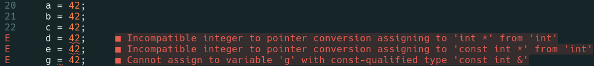

# Chapter 2. Variables and Basic Types

## Exercise 2.1

### `short`, `int`, `long` and `long long`

`short`, `int`, `long` and `long long` differ in size. The size of each one of those types varies across machines, but the standard guarantees their minimum sizes as listed in table below. The standard also guarantees that `sizeof(long long) >= sizeof(long) >= sizeof(int) >= sizeof(short)`.

| Type      | Minimum Size |
| :-------- | :----------: |
| short     | 16 bits      |
| int       | 16 bits      |
| long      | 32 bits      |
| long long | 64 bits      |

---
### `unsigned` and `signed`

`unsigned` types can only represent values greater than or equal to zero. `signed` types can represent negative values, positive values and zero.

---
### `float` and `double`

For `float` and `double` the standard specifies a minimum number of significant digits as listed in the table below. Tipically, `float`s are represented in 32 bits and `double`s in 64 bits.

| Type   | Minimum Size          |
| :----- | :-------------------: |
| float  | 6 significant digits  |
| double | 10 significant digits |

## Exercise 2.2

`rate`, `principal` and `payment` could be represented using floating-point numbers. Based on the advices given at the end of section 2.1.1, I'd use `double` for those variables.


## Exercise 2.3

```cpp
unsigned u = 10, u2 = 42;
std::cout << u2 - u << std::endl;  // 32
std::cout << u - u2 << std::endl;  // 2^32 - 32 (assuming 32-bit ints)

int i = 10, i2 = 42;
std::cout << i2 - i << std::endl;  //  32
std::cout << i - i2 << std::endl;  // -32

std::cout << i - u << std::endl;   // 0
std::cout << u - i << std::endl;   // 0
```


## Exercise 2.4

[`exercise2_04.cpp`](./exercise2_04.cpp)

```sh
$ ./exercise2_04
32
4294967264
32
-32
0
0
```


## Exercise 2.5

```cpp
'a'   // char
L'a'  // wchar_t
"a"   // const char*
L"a"  // const wchar_t*
```
```cpp
10    // int
10u   // unsigned int
10L   // long
10uL  // unsigned long
012   // int (octal)
0xC   // int (hexadecimal)
```
```cpp
3.14  // double
3.14f // float
3.14L // long double
```
```cpp
10    // int
10u   // unsigned int
10.   // double
10e-2 // double
```


## Exercise 2.6

```cpp
// month is initialized with the value 9 and day is initialized with the value 7
int month = 9, day = 7;

// ERROR: 9 is not a valid digit for an octal literal
int month = 09, day = 07;
```


## Exercise 2.7

```cpp
"Who goes with F\145rgus?\012" // "Who goes with Fergus?\n" (const char*)
```
```cpp
3.14e1L // 31.4 (long double)
```
```cpp
1024f  // ERROR: suffix f is defined only for floating-point literals
```
```cpp
3.14L  // 3.14 (long double)
```


## Exercise 2.8

[`exercise2_08.cpp`](./exercise2_08.cpp)


## Exercise 2.9

```cpp
// illegal - we cannot pass a variable definition as an argument
std::cin >> int input_value;

// fix
int input_value;
std::cin >> input_value;
```

```cpp
// illegal - the compiler will not let us list initialize a variable
// of built-in type if the initializer might lead to loss of information
int i = { 3.14 };

// fix (but the value will be truncated)
int i = 3.14;
```

```cpp
// legal if wage is already defined
double salary = wage = 9999.99;

// like this
double wage;
double salary = wage = 9999.99;
```

```cpp
// legal (but the value will be truncated)
int i = 3.14;
```


## Exercise 2.10

```cpp
#include <string>

std::string global_str; // empty string
int global_int;         // zero

int main()
{
    int local_int;          // undefined
    std::string local_str;  // empty string
}
```


## Exercise 2.11

```cpp
extern int ix = 1024;  // definition (initialization overrides extern)
int iy;                // definition
extern int iz;         // declaration
```


## Exercise 2.12

```cpp
int double = 3.14;      // invalid - double is a C++ keyword
int _;                  // invalid if defined in the global namespace
int catch-22;           // invalid - '-' is not allowed in identifiers
int 1_or_2 = 1;         // invalid - a digit cannot be the first char in an identifier
double Double = 3.14;   // valid - remember that identifiers are case-sensitive
```


## Exercise 2.13

```cpp
int i = 42;
int main()
{
    int i = 100;
    int j = i;   // j = 100
}
```


## Exercise 2.14

```cpp
int i = 100, sum = 0;
for (int i = 0; i != 10; ++i)
     sum += i;
std::cout << i << " " << sum << std::endl;
```

The fragment above is legal and it prints `100 45`.


## Exercise 2.15

```cpp
int ival = 1.01;
int &rval1 = 1.01;  // invalid - initializer must be an object
int &rval2 = ival;  
int &rval3;         // invalid - references must be initialized
```


## Exercise 2.16

```cpp
int i = 0, &r1 = i;
double d = 0, &r2 = d;

r2 = 3.14159;   // valid - d = 3.14159
r2 = r1;        // valid - d = i
i = r2;         // valid - i = d
r1 = d;         // valid - i = d
```


## Exercise 2.17

```cpp
int i, &ri = i;
i = 5; ri = 10;
std::cout << i << " " << ri << std::endl;
```

The code prints `10 10`.


## Exercise 2.18

[`exercise2_18.cpp`](./exercise2_18.cpp)


## Exercise 2.19

A reference:

- is not an object
- is just another name for an already existing object (operations on the reference **are operations on the referenced object**)
- provides a way to indirectly access an object
- must be initialized
- once initialized, remains bound to its initial object (we cannot rebind it to another object).

A pointer:

- is an object
- holds the address of another object
- like a reference, provides a way to indirectly access an object
- can be initialized (but it's not mandatory)
- can point to different objects over its lifetime
- needs to be dereferenced to yield the object to which it points.


## Exercise 2.20

```cpp
int i = 42;
int *p1 = &i;
*p1 = *p1 * *p1;
```

The fragment of code above computes the square of `i` and stores the result in `i`.


## Exercise 2.21

```cpp
int i = 0;
double* dp = &i;    // illegal - a pointer to double cannot point to an int
int *ip = i;        // illegal - we cannot assign an int variable to a pointer
int *p = &i;        // legal   - p holds the address of i
```


## Exercise 2.22

```cpp
// check if p points to something;
// the condition is false if p == nullptr (or 0), otherwise it is true
if (p)

// test the value of the variable to which p points;
// the condition is false if the value of the pointed object is zero, otherwise it is true
if (*p) 
```

## Exercise 2.23

Nope. *// TODO: Why not?*


## Exercise 2.24

```cpp
int i = 42;    

// this initialization is legal because void* is a special pointer type that
// can hold the address of any object
void *p = &i;  

// this initialization is illegal because the types of lp and &i differ
long *lp = &i;
```


## Exercise 2.25

```cpp
// ip is a pointer to an int and its value is undefined if it is a local variable or zero if it is global;
// i is a int and its value is undefined if it is a local variable or zero if it is global;
// r is a reference to an int and it is bound to the variable i
int* ip, i, &r = i;
```

```cpp
// i is an int and its value is undefined if it is a local variable or zero if it is global;
// ip is a pointer to an int and it is initialized to zero (null pointer)
int i, *ip = 0;
```

```cpp
// ip is a pointer to an int and its value is undefined if it is a local variable or zero if it is global;
// ip2 is a int and its value is undefined if it is a local variable or zero if it is global
int* ip, ip2;
```


## Exercise 2.26

```cpp
const int buf;      // illegal - constants must be initialized
int cnt = 0;        // legal
const int sz = cnt; // legal
++cnt;              // legal
++sz;               // illegal - constants cannot be changed
```


## Exercise 2.27

```cpp
// illegal - a reference to nonconst cannot be bound to a literal
int i = -1, &r = 0;
```

```cpp
// legal - p2 is a const pointer to int and it's initialized with the address of an int
int i2;
int *const p2 = &i2;
```

```cpp
// legal - a reference to const can be bound to a literal
const int i = -1, &r = 0;
```

```cpp
// legal - a const pointer to const int can point to nonconst int
int i2;
const int *const p3 = &i2;
```

```cpp
// legal - a pointer to const int can point to nonconst int
int i2;
const int *p1 = &i2;
```

```cpp
// illegal - 1) a reference must be initialized
//           2) a reference is not a object, so it can't be qualified as const
const int &const r2;
```

```cpp
// legal - 1) the value of a nonconst int can be assigned to a const int
//         2) a reference to const can be bound to a nonconst
int i;
const int i2 = i, &r = i;
```


## Exercise 2.28

```cpp
// illegal - cp is a const pointer and must be initialized
int i, *const cp;

// illegal - p2 is a const pointer and must be initialized
int *p1, *const p2;

// illegal - ic is a const int and must be initialized
const int ic, &r = ic;

// illegal - p3 is a const pointer and must be initialized
const int *const p3;

// legal - p is a pointer to const int
const int *p;
```


## Exercise 2.29

```cpp
// legal - a const int can be assigned to a nonconst int (we are just copying values here)
i = ic;

// illegal - a pointer to const cannot be assigned to a pointer to nonconst
p1 = p3;

// illegal - a pointer to nonconst cannot point to a const object
p1 = &ic;

// illegal - a const pointer cannot be changed
p3 = &ic;

// illegal - a const pointer cannot be changed
p2 = p1;

// illegal - a const cannot be changed
ic = *p3;
```


## Exercise 2.30

```cpp
const int v2 = 0;            // v2 - top-level const
int v1 = v2;                 
int *p1 = &v1, &r1 = v1;     
const int *p2 = &v2,         // p2 - low-level const
          *const p3 = &i,    // p3 - low-level and top-level const
          &r2 = v2;          // r2 - low-level const
```


## Exercise 2.31

```cpp
// illegal - r1 and v2 don't have the same low-level const and we can't convert const to nonconst
r1 = v2;

// illegal - p2 has low-level const but p1 doesn't
p1 = p2;

// legal - p1 and p2 don't have the same low-level const but we can convert nonconst to const
p2 = p1;

// illegal - p3 has low-level const but p1 doesn't
p1 = p3;

// legal - p2 and p3 have the same low-level const
p2 = p3;
```


## Exercise 2.32

```cpp
// illegal
int null = 0, *p = null;
```

```cpp
// this WAS legal in C++11, but now is considered a standard defect
constexpr int null = 0, *p = null;           
```

[Reference](https://stackoverflow.com/a/40787595/10255810)


## Exercise 2.33

```cpp
int i = 0, &r = i;
auto a = r;
const int ci = i, &cr = ci;
auto b = ci;
auto c = cr;
auto d = &i;
auto e = &ci;
const auto f = ci;
auto &g = ci;

a = 42;   // ok - a is an int and is assigned the value 42
b = 42;   // ok - b is an int and is assigned the value 42
c = 42;   // ok - c is an int and is assigned the value 42
d = 42;   // error - d is a int* and cannot be assigned an integer
e = 42;   // error - e is a const int* and cannot be assigned an integer
g = 42;   // error - g is a const int&, therefore it cannot be used to change the value of the object it refers to
```


## Exercise 2.34

[`exercise2_34.cpp`](./exercise2_34.cpp)

```sh
$ ./exercise2_34
before assignments
	a: 0
	b: 0
	c: 0
after assignments
	a: 42
	b: 42
	c: 42
```

And here are the diagnostics I get from my tools when I uncomment the assignments to `d`, `e`, and `g` in [`exercise2_34.cpp`](./exercise2_34.cpp):




## Exercise 2.35

```cpp
const int i = 42;
auto j = i;                 // j is an int
const auto &k = i;          // k is a const int&
auto *p = &i;               // p is a const int*
const auto j2 = i, &k2 = i; // j2 is a const int; k2 is a const int&
```


## Exercise 2.36

```cpp
int a = 3, b = 4;
decltype(a) c = a;      // c is an int
decltype((b)) d = a;    // d is an int&
++c;                    
++d;
```

`a == 4` `b == 4` `c == 4` `d == 4`


## Exercise 2.37

```cpp
int a = 3, b = 4;
decltype(a) c = a;      // c is an int
decltype(a = b) d = a;  // d is an int&
```

`a == 3` `b == 4` `c == 3` `d == 3`


## Exercise 2.38

`auto`:

- `auto` tells the compiler to deduce the type of a variable from its initializer.
- Variables defined with `auto` must have an initializer.
- `auto` ignores top-level `const`, but keep low-level `const`.
- If we want a top-level `const` we must be explicit: `const auto`.
- If we want a reference we need to be explicit too: `auto&`.

`decltype`:

- `decltype` tells the compiler to deduce the type of a variable from an expression *without evaluating* that expression.
- Variables defined with `decltype` don't need to be initialized.
- When the expression is a variable, `decltype` returns the type of the variable (including top-level `const` and reference).
- When the expression is not a variable, it returns the type that the expression yields.

---

```cpp
int i = 0;
const int ci = 1;

// auto and decltype deduce the same type:
auto a = i;         // int
decltype(i) b = 2;  // int

// auto and decltype deduce differing types:
auto c = ci;        // int
decltype(ci) d = 3; // const int
```


## Exercise 2.39

[`exercise2_39.cpp`](./exercise2_39.cpp)

```sh
$ g++ exercise2_39.cpp -o exercise2_39
exercise2_39.cpp:1:29: error: expected ‘;’ after struct definition
    1 | struct Foo { /* empty   */ } // Note: no semicolon
      |                             ^
      |                             ;
```


## Exercise 2.40

[`exercise2_40.h`](./exercise2_40.h)


## Exercise 2.41

[`exercise2_41a.cpp`](./exercise2_41a.cpp) /* revision of [`exercise1_20.cpp`](../ch01/exercise1_20.cpp) \*/<br>
[`exercise2_41b.cpp`](./exercise2_41b.cpp) /* revision of [`exercise1_21.cpp`](../ch01/exercise1_21.cpp) \*/<br>
[`exercise2_41c.cpp`](./exercise2_41c.cpp) /* revision of [`exercise1_22.cpp`](../ch01/exercise1_22.cpp) \*/<br>
[`exercise2_41d.cpp`](./exercise2_41d.cpp) /* revision of [`exercise1_23.cpp`](../ch01/exercise1_23.cpp) */

---
`exercise2_41e` /* revision of `Exercise 1.24` */
```sh
$ g++ exercise2_41d.cpp -o exercise2_41d
$ ./exercise2_41d < data/book_sales 
1 transaction(s) for 0-201-70353-X
1 transaction(s) for 0-201-82470-1
4 transaction(s) for 0-201-88954-4
2 transaction(s) for 0-399-82477-1
2 transaction(s) for 0-201-78345-X
```

---

[`exercise2_41f.cpp`](./exercise2_41f.cpp) /* revision of [`exercise1_25.cpp`](../ch01/exercise1_25.cpp) */

```sh
$ g++ exercise2_41f.cpp -o exercise2_41f
$ ./exercise2_41f < data/book_sales 
0-201-70353-X 4 99.96 24.99
0-201-82470-1 4 181.56 45.39
0-201-88954-4 16 198 12.375
0-399-82477-1 5 226.95 45.39
0-201-78345-X 5 110 22
```


## Exercise 2.42

[`Sales_data.h`](./Sales_data.h)<br>
[`exercise2_42a.cpp`](./exercise2_42a.cpp) /* revision of [`exercise2_41a.cpp`](./exercise2_41a.cpp) \*/<br>
[`exercise2_42b.cpp`](./exercise2_42b.cpp) /* revision of [`exercise2_41b.cpp`](./exercise2_41b.cpp) \*/<br>
[`exercise2_42c.cpp`](./exercise2_42c.cpp) /* revision of [`exercise2_41c.cpp`](./exercise2_41c.cpp) \*/<br>
[`exercise2_42d.cpp`](./exercise2_42d.cpp) /* revision of [`exercise2_41d.cpp`](./exercise2_41d.cpp) */

---
`exercise2_42e` /* revision of `exercise2_41e` */
```sh
$ g++ exercise2_42d.cpp -o exercise2_42d
$ ./exercise2_42d < data/book_sales 
1 transaction(s) for 0-201-70353-X
1 transaction(s) for 0-201-82470-1
4 transaction(s) for 0-201-88954-4
2 transaction(s) for 0-399-82477-1
2 transaction(s) for 0-201-78345-X
```

---

[`exercise2_42f.cpp`](./exercise2_42f.cpp) /* revision of [`exercise2_41f.cpp`](./exercise2_41f.cpp) */

```sh
$ g++ exercise2_42f.cpp -o exercise2_42f
$ ./exercise2_42f < data/book_sales 
0-201-70353-X 4 99.96 24.99
0-201-82470-1 4 181.56 45.39
0-201-88954-4 16 198 12.375
0-399-82477-1 5 226.95 45.39
0-201-78345-X 5 110 22
```
